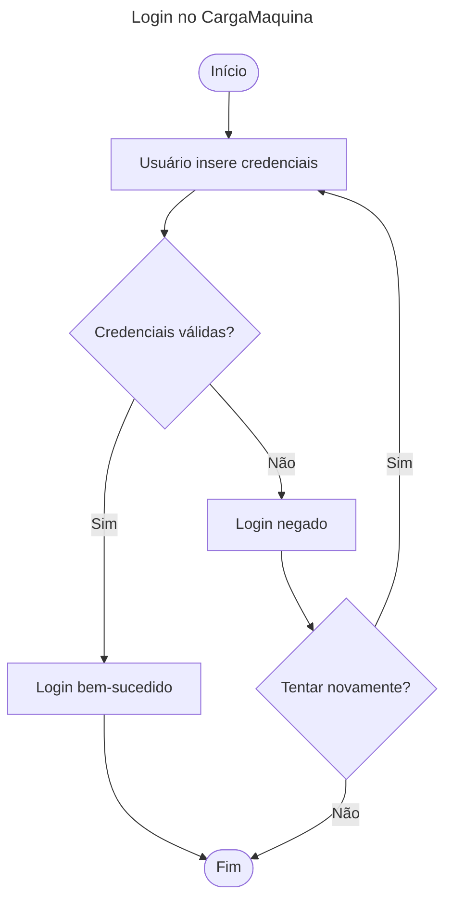
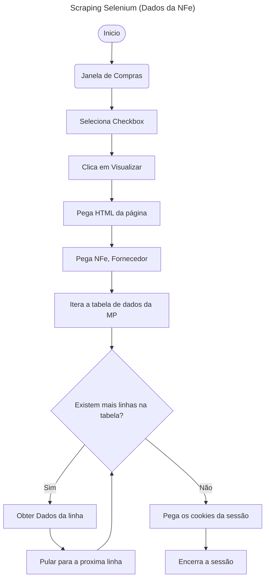
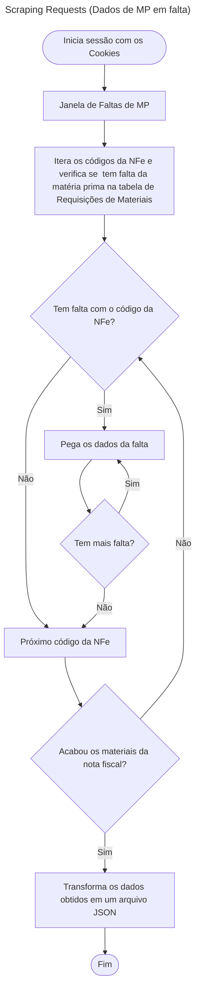
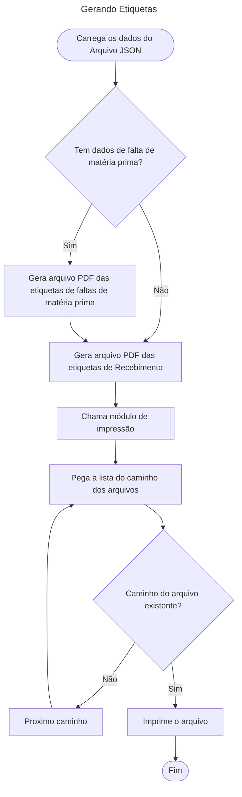

# Fluxograma do Projeto: Gerador de Etiqueta de Recebimento

```mermaid
---
title: Login no CargaMaquina
---
flowchart TD
    Start([Início]) --> InputCredentials[Usuário insere credenciais]
    InputCredentials --> ValidateCredentials{Credenciais válidas?}
    ValidateCredentials -->|Sim| AccessGranted[Login bem-sucedido]
    ValidateCredentials -->|Não| AccessDenied[Login negado]
    AccessDenied --> RetryOption{Tentar novamente?}
    RetryOption -->|Sim| InputCredentials
    RetryOption -->|Não| End([Fim])
    AccessGranted --> End([Fim])
```

```mermaid
---
title: Scraping Selenium (Dados da NFe)
---
    flowchart TD
    Start([Inicio]) --> Window(Janela de Compras)
    Window --> Checkbox[Seleciona Checkbox]
    Checkbox --> LookOrder[Clica em Visualizar]
    LookOrder --> GetHTML[Pega HTML da página]
    GetHTML --> GetElements[Pega NFe, Fornecedor]
    GetElements --> GetMP[Itera a tabela de dados da MP]
    GetMP --> CheckRow{Existem mais linhas na tabela?}
    CheckRow -->|Sim| GetData[Obter Dados da linha]
    GetData  --> NextRow[Pular para a proxima linha]
    NextRow --> CheckRow
    CheckRow -->|Não| GetCookies[Pega os cookies da sessão]
    GetCookies --> End[Encerra a sessão]
```

```mermaid
---
title: Scraping Requests (Dados de MP em falta)
---
    flowchart TD
    Start([Inicia sessão com os Cookies]) --> PendingPage[Janela de Faltas de MP]
    PendingPage --> NFeCode[Itera os códigos da NFe e verifica se  tem falta da matéria prima na tabela de Requisições de Materiais]
    NFeCode --> PendingMaterial{Tem falta com o código da NFe?}
    PendingMaterial -->|Não| NextNFeRow[Próximo código da NFe]
    NextNFeRow --> EndedNFeCodes{Acabou os materiais da nota fiscal?}
    PendingMaterial -->|Sim| GetPendingMaterialData[Pega os dados da falta]
    GetPendingMaterialData --> CheckMorePending{Tem mais falta?}
    CheckMorePending -->|Sim| GetPendingMaterialData
    CheckMorePending -->|Não| NextNFeRow
    EndedNFeCodes -->|Não| PendingMaterial
    EndedNFeCodes -->|Sim| DataToJson[Transforma os dados obtidos em um arquivo JSON]
    DataToJson --> End([Fim])
```

```mermaid
---
title: Gerando Etiquetas
---
    flowchart TD
    Start([Carrega os dados do Arquivo JSON]) --> CheckPendingMaterial{Tem dados de falta de matéria prima?}
    CheckPendingMaterial -->|Não| GenerateNFeLabel[Gera arquivo PDF das etiquetas de Recebimento]
    CheckPendingMaterial -->|Sim| GeneratePendingMaterialLabel[Gera arquivo PDF das etiquetas de faltas de matéria prima]
    GeneratePendingMaterialLabel --> GenerateNFeLabel
    GenerateNFeLabel --> PrintLabel[[Chama módulo de impressão]]
    PrintLabel --> GetFilePathList[Pega a lista do caminho dos arquivos]
    GetFilePathList --> CheckFilePath{Caminho do arquivo existente?}
    CheckFilePath -->|Não| NextFilePath[Proximo caminho]
    NextFilePath --> GetFilePathList
    CheckFilePath -->|Sim| Print[Imprime o arquivo]
    Print --> End([Fim])
```
    